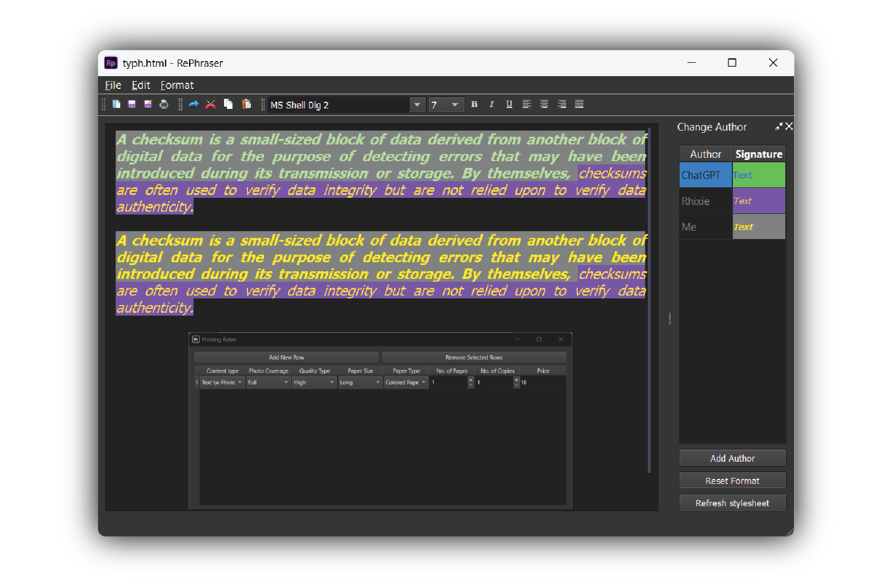

# RePhraser — A rich text editor in PyQt

The word processor for rephrasing your essay from multiple sources
 
The editor supports multiple fonts, styles and paragraph text alignment.
There is also support for drag-drop of images, which are automatically
opened and embedded.

Saves and opens HTML format documents.
 

## Other licenses

Icons used in the application are by [Yusuke Kamiyaman](http://p.yusukekamiyamane.com/).
